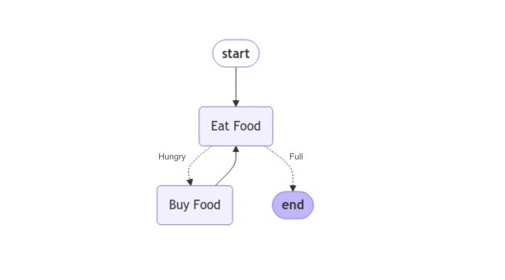

1. LangGraph is all about implementing LLM applications as directed graphs.
2. A directed graph as a sequence of instructions composed of nodes and edges
3. Nodes represent actions that your graph can take, such as calling a function, and edges tell you which node to go to next.
4. In general, node functions should return GraphState objects, while edge functions return strings that tell you which node or nodes to navigate to.

## Problem:
Suppose you work for a large real estate development company. Your company receives hundreds of emails a day from regulatory entities and other organizations regarding active construction sites.
## Solution: Build An AI Agent:
1. Extract structured fields like dates, names, phone numbers, and locations from email messages
2. Notify internal stakeholders if an email requires immediate escalation
3. Create tickets with your company’s legal team using the information extracted from the email
4. Forward and reply to emails that were sent to the wrong address
5. 123456
6. 1245555
